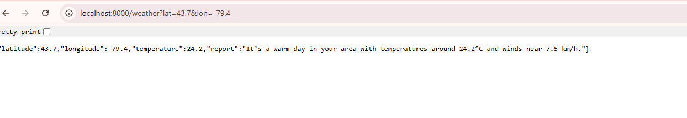
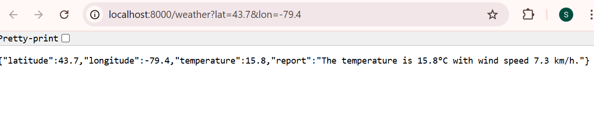

# Weather API Wrapper

A production-ready wrapper around the [Open-Meteo API](https://open-meteo.com/) with **LLM-powered weather reports**, a simple **frontend UI**, and **Dockerized deployment**.

---

## Prerequisites
- Python 3.11+
- pip (Python package manager)
- Docker (optional, for containerized run)
- Git

---

## Features
- **FastAPI backend**: `/weather` endpoint accepts latitude & longitude.
- **External API integration**: Fetches current weather from Open-Meteo.
- **LLM integration**: Generates human-readable weather reports using OpenAI GPT (with fallback if no API key).
- **Frontend UI**: Simple HTML+JS form to query weather reports.
- **Dockerized**: Multi-stage build for small, efficient images.
- **Testing**: Unit + integration tests with pytest.

---

## Tech Stack
- **Backend**: FastAPI, httpx, Pydantic
- **LLM**: OpenAI GPT (optional, fallback included)
- **Frontend**: HTML + JavaScript
- **Containerization**: Docker, Docker Compose (optional)
- **Testing**: pytest, pytest-asyncio

---

## Getting Started

### 1. Clone the repo
```bash
git clone https://github.com/your-username/weather-api-wrapper.git
cd weather-api-wrapper
```

### 2. Install dependencies (local run)
```bash
pip install -r requirements.txt
```

### 3. Run locally
```bash
python -m uvicorn app.main:app --reload --host 0.0.0.0 --port 8000
```

---

## Example Usage

### Using Curl
```bash
curl "http://localhost:8000/weather?lat=43.7&lon=-79.4"
```

**Response:**
```json
{
  "latitude": 43.7,
  "longitude": -79.4,
  "temperature": 16.0,
  "report": "The temperature is 16.0°C with wind speed 7.6 km/h."
}
```

### Using the Web UI

Open: [http://localhost:8000/frontend/index.html](http://localhost:8000/frontend/index.html)

Enter latitude/longitude → Get Weather → See formatted report.

---

## Screenshots

### Web UI



### API JSON Response


- **API** → [http://localhost:8000/weather?lat=43.7&lon=-79.4](http://localhost:8000/weather?lat=43.7&lon=-79.4)
- **UI** → [http://localhost:8000/frontend/index.html](http://localhost:8000/frontend/index.html)

---

## Running with Docker

### Build & run
```bash
docker build -t weather-api .
docker run -p 8000:8000 -e OPENAI_API_KEY=your_key weather-api
```

### Using Docker Compose
```bash
docker-compose up --build
```

---

## Testing

Run all tests:
```bash
pytest -v
```

- **Unit tests** → `test_weather.py` (service) & `test_llm.py` (LLM logic)
- **Integration tests** → `test_api.py` (FastAPI endpoint `/weather`)

---

## Project Structure
```
weather-api-wrapper/
│── app/
│   ├── main.py          # FastAPI entrypoint
│   ├── routes.py        # /weather route
│   ├── services.py      # Open-Meteo API call
│   ├── llm.py           # LLM wrapper for reports
│   ├── models.py        # Pydantic models
│   ├── __init__.py
│   └── tests/           # Unit & integration tests
│       ├── test_weather.py
│       ├── test_llm.py
│       └── test_api.py
│
│── frontend/
│   └── index.html       # Simple UI
│
│── requirements.txt     # Dependencies
│── Dockerfile           # Multi-stage build
│── docker-compose.yml   # (Optional) for local dev
│── .dockerignore
│── .gitignore
│── README.md
```

---

##  Environment Variables

- `OPENAI_API_KEY`  
  If not provided, fallback reports will be used.
